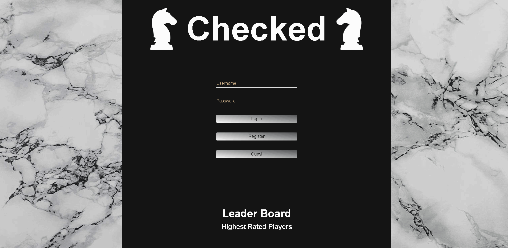

<section>
  <h1>Checked: An Overview.</h1>
  
Created as a group collaboration for their final project, Checked is a full stack application built in React where users can challenge each other to a lively game of chess. <a href="https://www.bradysnuggs.net/index.html" target="_blank" alt="Link to Brady Snuggs' portfolio">Brady Snuggs</a>, <a href="https://michelleeditor2.wixsite.com/portfolio" target="_blank" alt="link to Michelle Jones' portfolio">Michelle Jones</a>, and <a href="https://www.jordanoftroy.com/" target="_blank" alt="Link to Jordan Smithson's portfolio">Jordan Smithson</a> are proud to present to you, Checked. 

</section>

<section>
  <h1>Technologies</h1>

  <h3>Main Stack</h3>
    <ul>
      <li>JavaScript</li>
      <li>React.js</li>
      <li>Redux</li>
      <li>Node.js</li>
      <li>Express</li>
      <li>Massive</li>
      <li>Axios</li>
      <li>PostgreSQL</li>
    </ul>

  <h3>Additional Libraries</h3>
    <ul>
      <li>Bcrypt</li>
      <li>Chess.js</li>
      <li>Chessboardjsx</li>
      <li>Socket.io</li>
    </ul>

  <h3>Styling</h3>
    <ul>
      <li>SASS</li>
      <li>Styled Components</li>
    </ul>

  
Checked was built with JavaScript, React, and Redux. The Back-End is constructed with Node.js and a static Express server is used to communicate with the PostgreSQL database. Bcrypt is used to protect users information and secure the database. The logic is provided by Chess.js,  and the chessboard is provided by ChessboardJSX. Socket.io is used to provide players with engaging turn-based action, as well as allowing them to hurl insults at one another.  

</section>

<section>

Login as a guest and play unrated against the computer or other players!

If playing the computer isn't interesting enough, play and chat with other players where rating points are on the line.

</section>

<section>
  <h2>Creators</h2>
  
 <a href="https://www.bradysnuggs.net/index.html" target="_blank" alt="Link to Brady Snuggs' portfolio">Brady Snuggs</a>, <a href="https://michelleeditor2.wixsite.com/portfolio" target="_blank" alt="link to Michelle Jones' portfolio">Michelle Jones</a>, and <a href="https://www.jordanoftroy.com/" target="_blank" alt="Link to Jordan Smithson's portfolio">Jordan Smithson</a>

</section>

<section>
Local:
- npm i
- npm run start
</section>

